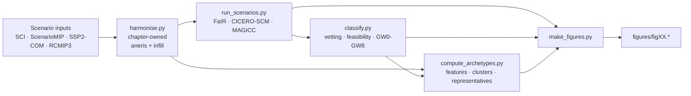

# AR7 WG1 Chapter 5 Ensemble

Run FaIR 2.x, CICERO-SCM 2.1.2 and MAGICC across the IPCC AR7 WG1 Chapter 5
scenario sets (Scenario Compass 2025 / SCI, ScenarioMIP CMIP7, SSP2-COM,
RCMIP3) through the openscm-runner engine, then classify, cluster into
emissions archetypes, and plot.

This site is the narrative companion to the source tree. The package itself
(`src/ar7_ch5/`) is the canonical home for the run, classification, archetype
and figure logic; command-line entry points live in `scripts/`; notebooks are
figure-only.

## What this repository does

## Where to start

- New to the machine? Read [Installation](installation.md) and
  [Running on NAC](running_on_nac.md).
- Need the input data in place? See [Data setup](data_setup.md).
- Want to understand the science? See [Methods](methods.md).
- Looking for a function? Browse the
  [API reference](reference/load.md).

## Status

M1-M8 complete: smoke runs, the SCI ensemble batch on NAC, the vetting /
feasibility / classification port, SSP2-COM ingestion, ScenarioMIP CMIP7,
RCMIP3 concentration-driven diagnostics, and the emissions-archetypes
port (feature extraction, JSON-tunable strategy labelling, representative
selection, `fig07`). Figures are jupytext-paired scripts driven by YAML
configuration with a read-only cache reporter.

The chapter now owns harmonisation + infilling end-to-end through a single
[`gcages.cmip7_scenariomip`-backed pipeline](reference/harmonise.md)
that serves SCI, ScenarioMIP CMIP7 and SSP2-COM; the scientific choices
the pipeline encodes (history anchor, aneris overrides, infilling DB,
Halon strip, etc.) are tracked in
[harmonisation open questions](harmonisation_open_questions.md).
